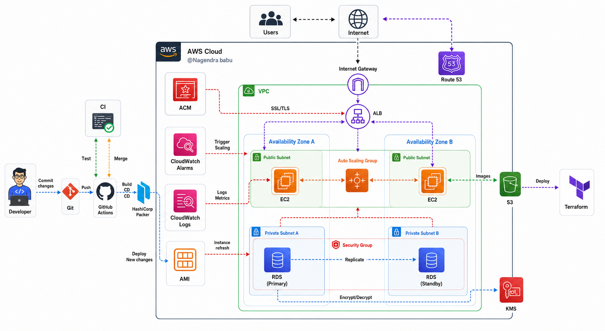

# AWS DevOps Pipeline

A production-grade CI/CD pipeline that automatically builds, tests, and deploys a Next.js application to AWS using GitHub Actions, HashiCorp Packer, and Terraform.

## Architecture



**Flow:** Developer pushes code → GitHub Actions triggers CI (test/lint) and CD (Packer AMI → Terraform → ASG refresh) → App goes live on AWS behind an Application Load Balancer with Auto Scaling.

---

## Tech Stack

| Category | Technology |
|----------|-----------|
| **Application** | Next.js 15, TypeScript |
| **CI/CD** | GitHub Actions |
| **AMI Build** | HashiCorp Packer 1.11 |
| **Infrastructure** | Terraform 1.9 |
| **Cloud** | AWS (us-east-1) |
| **Web Server** | Nginx (reverse proxy) |
| **Runtime** | Node.js 20 LTS + systemd |
| **Database** | RDS PostgreSQL 16.3 Multi-AZ |
| **Auth** | GitHub OIDC (no static keys) |

---

## Project Structure

```
aws-devops-project/
│
├── .github/
│   └── workflows/
│       ├── ci.yml              # PR: lint, test, terraform validate
│       └── cd.yml              # Push to main: Packer → Terraform → ASG refresh
│
├── app/                        # Next.js application
│   ├── src/app/
│   │   ├── page.tsx
│   │   └── layout.tsx
│   ├── next.config.js          # output: standalone
│   └── package.json
│
├── packer/
│   ├── ubuntu.pkr.hcl          # Packer template (Ubuntu 22.04)
│   └── scripts/
│       ├── 01-system-setup.sh  # apt-get update/upgrade
│       ├── 02-install-node.sh  # Node.js 20 LTS
│       ├── 03-setup-app.sh     # Copy pre-built Next.js artifacts
│       ├── 04-setup-nginx.sh   # Nginx reverse proxy config
│       └── 05-setup-systemd.sh # nextjs-app.service + nginx enable
│
├── terraform/
│   ├── bootstrap/              # One-time: S3 state bucket + DynamoDB lock
│   ├── github-oidc/            # One-time: IAM OIDC role for GitHub Actions
│   ├── modules/
│   │   ├── vpc/                # VPC, subnets (public/private), IGW, NAT, SGs
│   │   ├── kms/                # KMS key (EBS + RDS + S3 + CloudWatch)
│   │   ├── s3/                 # Artifacts bucket
│   │   ├── alb/                # Application Load Balancer + target group
│   │   ├── ec2-asg/            # Launch template + Auto Scaling Group
│   │   ├── rds/                # PostgreSQL Multi-AZ + Secrets Manager
│   │   ├── cloudwatch/         # Alarms, dashboard, log groups
│   │   ├── acm/                # SSL/TLS certificate (ACM)
│   │   └── route53/            # DNS records
│   ├── main.tf
│   ├── variables.tf
│   ├── outputs.tf
│   └── terraform.tfvars.example
│
└── docs/
    └── architecture.png
```

---

## CI/CD Pipeline

### On Pull Request → `ci.yml`
1. Install Node.js dependencies
2. Run ESLint (`npm run lint`)
3. Run tests (`npm run test`)
4. Build check (`npm run build`)
5. `terraform fmt -check` — format validation
6. `terraform validate` — config validation

### On Push to `main` → `cd.yml`

```
┌─────────────────────────────────────────────────────────┐
│ Job 1: Build AMI with Packer          (~8 min)          │
│  → npm ci && npm run build  (on CI runner)              │
│  → packer build → new Ubuntu 22.04 AMI with app baked  │
└──────────────────────────┬──────────────────────────────┘
                           │ ami_id output
┌──────────────────────────▼──────────────────────────────┐
│ Job 2: Deploy Terraform Infrastructure  (~30s)          │
│  → terraform init + plan + apply                        │
│  → creates/updates: VPC, ALB, ASG, RDS, KMS, CW        │
└──────────────────────────┬──────────────────────────────┘
                           │
┌──────────────────────────▼──────────────────────────────┐
│ Job 3: Trigger ASG Instance Refresh  (~12 min)          │
│  → Rolling refresh (50% min healthy)                    │
│  → New EC2 instances launch from new AMI                │
│  → Old instances terminate after health check passes    │
└─────────────────────────────────────────────────────────┘
```

---

## AWS Infrastructure

### Networking (VPC Module)
- **VPC** — `10.0.0.0/16`
- **Public Subnets** — 2x across us-east-1a and us-east-1b (ALB + EC2)
- **Private Subnets** — 2x across us-east-1a and us-east-1b (RDS)
- **Internet Gateway** — public traffic entry
- **NAT Gateway** — private subnets outbound internet access
- **Security Groups** — ALB → EC2 (port 80) → RDS (port 5432) only

### Security
- **GitHub OIDC** — GitHub Actions authenticates via OIDC, no static AWS keys stored
- **KMS** — single customer-managed key encrypts EBS volumes, RDS, S3, CloudWatch logs
- **Secrets Manager** — RDS password auto-generated and stored, never in code
- **IAM** — EC2 instances use instance profile with least-privilege policies

### Compute
- **AMI** — Ubuntu 22.04, Node.js 20, Nginx, Next.js app pre-installed via Packer
- **Launch Template** — KMS-encrypted gp3 EBS (20GB), IAM instance profile
- **Auto Scaling Group** — min: 1, desired: 2, max: 4 — ELB health checks
- **Scaling** — CPU > 70% for 4 min → scale out | CPU < 20% for 10 min → scale in

### Database
- **RDS PostgreSQL 16.3** — Multi-AZ (primary in us-east-1a, standby in us-east-1b)
- **Private subnets only** — no public internet access
- **KMS encrypted** — at-rest encryption with customer-managed key
- **Deletion protection** — enabled in production

### Monitoring
- **CloudWatch Log Group** — `/aws/aws-devops-app/app`
- **CloudWatch Alarms** — ALB 5xx errors, CPU high, CPU low
- **CloudWatch Dashboard** — EC2 CPU utilization + ALB request count

---

## Setup Guide

### Prerequisites

| Tool | Version |
|------|---------|
| AWS CLI | v2 |
| Terraform | >= 1.9 |
| Packer | >= 1.11 |
| Node.js | 20 LTS |
| Git | any |

You also need:
- An AWS account with admin access
- A GitHub account

---

### Step 1 — Clone and Configure AWS CLI

```bash
git clone https://github.com/MuhammadWaizImran/aws-devops-pipeline.git
cd aws-devops-pipeline

# Configure AWS credentials
aws configure
# AWS Access Key ID: <your-key>
# AWS Secret Access Key: <your-secret>
# Default region: us-east-1
# Default output format: json

# Verify
aws sts get-caller-identity
```

---

### Step 2 — Bootstrap Terraform Backend

Creates the S3 bucket (remote state) and DynamoDB table (state lock). Run **once only**.

```bash
cd terraform/bootstrap
terraform init
terraform apply -auto-approve
```

Note the output `state_bucket_name`. Then update `terraform/main.tf`:
```hcl
backend "s3" {
  bucket = "tf-state-YOUR_ACCOUNT_ID"   # replace with your account ID
  key    = "aws-devops-project/terraform.tfstate"
  region = "us-east-1"
}
```

---

### Step 3 — Set Up GitHub Actions OIDC

Creates an IAM OIDC provider + role so GitHub Actions can authenticate to AWS without static keys.

```bash
cd terraform/github-oidc
terraform init
terraform apply \
  -var="github_org=YOUR_GITHUB_USERNAME" \
  -var="github_repo=aws-devops-pipeline"

# Copy the output role ARN
```

---

### Step 4 — Add GitHub Secrets

Go to your GitHub repo → **Settings** → **Secrets and variables** → **Actions** → **New repository secret**

| Secret Name | Value |
|-------------|-------|
| `AWS_ROLE_ARN` | Role ARN from Step 3 output |
| `TF_STATE_BUCKET` | Bucket name from Step 2 output |

---

### Step 5 — Deploy

Push to `main` — the full pipeline triggers automatically:

```bash
git add .
git commit -m "initial deploy"
git push origin main
```

Watch the pipeline at: `https://github.com/YOUR_USERNAME/aws-devops-pipeline/actions`

The full pipeline takes ~21 minutes:
- Packer AMI build: ~8 min
- Terraform apply: ~30 sec
- ASG instance refresh: ~12 min

---

### Step 6 — Verify

Once the pipeline completes, get your ALB URL:

```bash
cd terraform
terraform output app_url
```

Open the URL in your browser — your app is live.

---

## Useful Commands

```bash
# Check live instances in ASG
aws autoscaling describe-auto-scaling-groups \
  --auto-scaling-group-names aws-devops-app-asg \
  --query "AutoScalingGroups[0].Instances[*].{ID:InstanceId,State:LifecycleState,Health:HealthStatus}" \
  --output table

# Check ALB target health
aws elbv2 describe-target-health \
  --target-group-arn $(terraform -chdir=terraform output -raw target_group_arn) \
  --output table

# SSH into EC2 via SSM (no key pair needed)
aws ssm start-session --target INSTANCE_ID

# Watch app logs
aws logs tail /aws/aws-devops-app/app --follow

# Manually trigger instance refresh
aws autoscaling start-instance-refresh \
  --auto-scaling-group-name aws-devops-app-asg \
  --strategy Rolling \
  --preferences '{"MinHealthyPercentage":50,"InstanceWarmup":300}'

# Destroy all infrastructure (careful!)
cd terraform && terraform destroy
```

---

## Cost Estimate (us-east-1)

| Resource | ~Monthly |
|----------|----------|
| EC2 t3.small × 2 | $30 |
| RDS db.t3.micro Multi-AZ | $30 |
| ALB | $20 |
| NAT Gateway | $35 |
| S3 + KMS + CloudWatch | $5 |
| **Total** | **~$120/month** |

> **Tip:** For a portfolio/learning setup, set `asg_desired_capacity = 1` and `multi_az = false` on RDS to cut costs to ~$25/month.

---

## Author

**Muhammad Waiz Imran** — Cloud & Data Engineer

[](https://www.linkedin.com/in/muhammad-waiz-imran)
[](https://github.com/MuhammadWaizImran)
